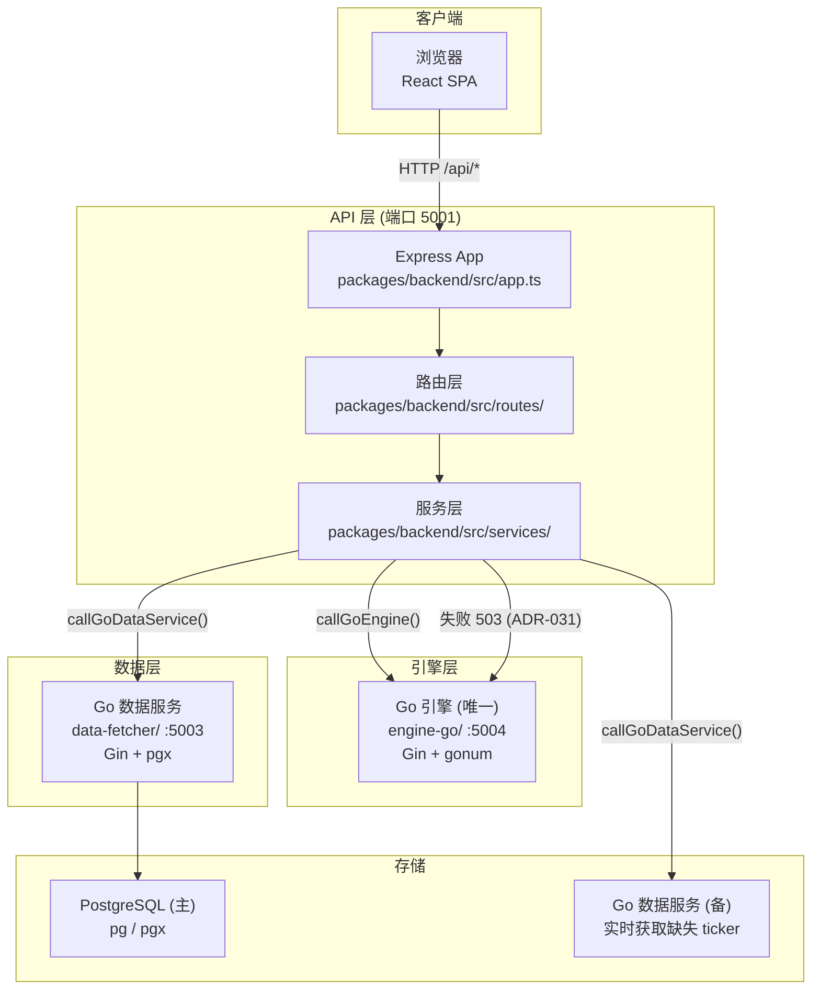

# 架构详解 (Architecture)

> 本文档详细描述回测平台的服务拓扑、降级链、数据流和关键设计决策。
> 结构规范见 [project-spec.md](../.trae/documents/project-spec.md)，API 定义见 [tech-architecture.md](../.trae/documents/tech-architecture.md)。

---

## 1. 服务拓扑



---

## 2. 降级链详解

### 2.1 引擎降级（Go Fail-Closed，ADR-031）

**决策**：Go 引擎不可用时直接返回 503 + Retry-After，不再静默降级到 Node/Rust 备用引擎。

**触发条件**（见 [packages/backend/src/routes/backtestRoutes.ts](../packages/backend/src/routes/backtestRoutes.ts) 的引擎调用逻辑）：

- 连接拒绝（ECONNREFUSED）
- HTTP 状态码非 2xx
- 5 秒超时（`timeoutMs = 5000`）
- 熔断器 Open 状态（见 [ADR-016](adr/ADR-016-熔断器策略.md)）

**处理逻辑**：

- `callEngineStrict()` → 失败 → `EngineUnavailableError` → HTTP 503 + `Retry-After: 30`
- 熔断器（opossum）：50% 错误阈值，30s 半开重置，最小 5 请求窗口
- 响应体格式：`{ success: false, error: { type, title, status, code, detail, retryAfterSeconds } }`

### 2.2 数据降级（PostgreSQL → Go 数据服务，ADR-007）

**降级链**：PostgreSQL（主）→ Go 数据服务（备，缺失 ticker 实时抓取）

**触发条件**（见 [packages/backend/src/routes/dataRoutes.ts](../packages/backend/src/routes/dataRoutes.ts) 的 `callService`）：

- 连接拒绝（ECONNREFUSED）
- HTTP 状态码非 2xx
- 30 秒超时（`timeoutMs = 30000`）
- PostgreSQL 熔断器 Open 状态（见 [ADR-016](adr/ADR-016-熔断器策略.md)）

**降级逻辑**：

- PostgreSQL 不可用 → 返回 503 + Retry-After（fail-closed，不再降级到 JSON 文件）
- 查询缺失 ticker → Go 数据服务实时获取（baostock / HTTP API）
- 搜索：PostgreSQL 全文搜索失败 → 降级到 ticker 前缀匹配扫描（不使用 Python）

---

## 3. 数据流

### 3.1 组合回测完整流程

```
1. 用户在前端设置参数 + 组合 → 点击"回测"
2. 前端 POST /api/backtest/portfolio { portfolios, parameters }
3. 后端 backtestRoutes.ts:
   a. 收集所有 ticker（组合资产 + 基准）
   b. fetchHistoryData() 获取价格数据
      - 优先 PostgreSQL 查询（pg Pool）
      - Go 数据服务实时获取（缺失 ticker，ADR-007）
   c. 加载 CPI 数据（按 baseCurrency 选择 cn/us）
   d. 加载汇率数据（baseCurrency === 'cny' 时）
   e. callGoEngine('/api/engine/backtest', goBody)
      - 失败返回 503 + Retry-After（fail-closed，ADR-031）
   f. 返回 { success, data, warnings? }
4. 前端渲染结果（增长图/回撤/统计/年度收益/月度收益/相关性）
```

### 3.2 蒙特卡洛模拟流程

```
1. 前端 POST /api/backtest/monte-carlo { portfolio|portfolios, parameters, mcParams }
2. 后端:
   a. 获取价格数据
    b. 调用 Go 引擎 /api/engine/monte-carlo
    c. Go 引擎不可用时返回 503 + Retry-After（fail-closed，ADR-031）
3. 返回百分位路径、成功概率、分布统计
```

---

## 4. 端口分配

| 服务              | 端口                      | 配置位置                    |
| ----------------- | ------------------------- | --------------------------- |
| 前端 Vite         | 5176                      | vite.config.ts              |
| 后端 API          | 5001                      | `PORT` 环境变量 / server.ts |
| Go 引擎           | 5004                      | engine-go/ (环境变量)       |
| Go 数据服务       | 5003                      | data-service/ (环境变量)    |
| PostgreSQL (主)   | 5432                      | DATABASE_URL 环境变量       |
| PostgreSQL 读副本 | 5432                      | k8s/postgres-replica.yaml   |
| PgBouncer         | 5432                      | k8s/pgbouncer.yaml          |
| Redis             | 6379                      | docker-compose.yml          |
| OTel Collector    | 4317 (gRPC) / 4318 (HTTP) | k8s/otel-collector.yaml     |

---

## 5. 入口文件职责

后端有 2 个入口文件，职责不同：

| 文件                                           | 用途              | 说明                                               |
| ---------------------------------------------- | ----------------- | -------------------------------------------------- |
| [app.ts](../packages/backend/src/app.ts)       | Express 应用配置  | 中间件、路由挂载、错误处理。被 server.ts 引用      |
| [server.ts](../packages/backend/src/server.ts) | 本地开发/生产入口 | `app.listen()` 启动 HTTP 服务，处理 SIGTERM/SIGINT |

---

## 6. 关键模块

### 6.1 后端路由层 (`packages/backend/src/routes/`)

| 文件                         | 路径前缀                     | 职责                                           |
| ---------------------------- | ---------------------------- | ---------------------------------------------- |
| `healthRoutes.ts`            | `/api`                       | 健康检查、监控指标、debug 端点                 |
| `dataRoutes.ts`              | `/api/v1/data`               | 历史数据、搜索、CPI                            |
| `dataManageRoutes.ts`        | `/api/v1/data/manage`        | 数据管理（批量更新等）                         |
| `backtestRoutes.ts`          | `/api/v1/backtest`           | 回测/分析/蒙特卡洛/优化/有效前沿               |
| `backtestOptimizerRoutes.ts` | `/api/v1/backtest-optimizer` | 回测优化器（有效前沿、Markowitz 优化）         |
| `tacticalRoutes.ts`          | `/api/v1/tactical`           | 战术分配（信号驱动动态权重回测）               |
| `tacticalGridRoutes.ts`      | `/api/v1/tactical-grid`      | 战术网格搜索（参数空间遍历优化）               |
| `signalRoutes.ts`            | `/api/v1/signal`             | 信号分析（单/双/多信号）                       |
| `pcaRoutes.ts`               | `/api/v1/pca`                | 主成分分析                                     |
| `letfRoutes.ts`              | `/api/v1/letf`               | 杠杆 ETF 滑点分析                              |
| `goalOptimizerRoutes.ts`     | `/api/v1/goal-optimizer`     | 目标优化（蒙特卡洛财务目标达成概率）           |
| `authRoutes.ts`              | `/api/v1/auth`               | 认证鉴权（登录、令牌刷新、登出、身份查询）     |
| `apiKeyRoutes.ts`            | `/api/v1/keys`               | 按组织 API Key 管理（ADR-033）                 |
| `portfolioRoutes.ts`         | `/api/v1/portfolios`         | 租户作用域组合持久化（ADR-034）                |
| `accountRoutes.ts`           | `/api/v1/configs`            | 租户作用域命名配置持久化（ADR-034）            |
| `runRoutes.ts`               | `/api/v1/runs`               | 租户作用域回测历史持久化（ADR-034）            |
| `orgRoutes.ts`               | `/api/v1/orgs`               | 组织与成员管理、邀请（ADR-035）                |
| `billingRoutes.ts`           | `/api/v1/billing`            | Stripe 计费（订阅、Checkout、Portal，ADR-036） |
| `jobRoutes.ts`               | `/api/v1`                    | 异步任务状态查询（ADR-019 所有权隔离）         |
| `adminRoutes.ts`             | `/api/v1/admin`              | 管理后台接口                                   |

> 注：认证授权已实现 JWT + RBAC 模型（见 [ADR-017](adr/ADR-017-认证授权模型.md)），保留 `x-api-key` 兼容模式（analyst 角色）。

### 6.2 后端服务层 (`packages/backend/src/services/`)

| 文件                  | 职责                                                      |
| --------------------- | --------------------------------------------------------- |
| `dataService.ts`      | 价格数据获取（PostgreSQL + Go 数据服务降级）、ticker 搜索 |
| `engineService.ts`    | 引擎调用封装                                              |
| `batchDataService.ts` | 批量数据服务                                              |

> 注：Rust 引擎 `engine-rs/` 已根据 ADR-031 删除，Go 引擎 (`engine-go`) 是 backtest / 蒙特卡洛 / 优化器 / 有效前沿的**唯一计算引擎**，不可用时返回 503 + Retry-After（fail-closed，无 Node 降级）。
>
> **Node-canonical 引擎职责清单**（`packages/backend/src/engine/`）：仅承载以下非核心路径——`tactical` / `tacticalGrid` / `signal` / `goalOptimizer` / `pca` / `letf`。backtest / 蒙特卡洛 / 优化器 / 有效前沿一律走 Go 引擎，无 Node 降级。

### 6.3 Go 引擎 (`engine-go/`)

| 模块     | 职责                                             |
| -------- | ------------------------------------------------ |
| 回测核心 | 组合回测、统计指标、SWR/PWR（gonum/stat）        |
| 蒙特卡洛 | 区块自举采样（gonum/stat/dist + sync.Pool 并行） |
| 优化器   | Markowitz 优化、有效前沿（gonum/optimize）       |

> **已退役 (ADR-031)**：Rust 引擎 `engine-rs/` 目录已删除。`engine-go` 是唯一计算引擎，不可用时返回 503。 |

### 6.4 前端页面 (`packages/frontend/src/pages/`)

| 页面                             | 路由                       | 功能             |
| -------------------------------- | -------------------------- | ---------------- |
| `BacktestPage.tsx`               | `/`                        | 组合回测（主页） |
| `AnalysisPage.tsx`               | `/analysis`                | 资产分析         |
| `MonteCarloPage.tsx`             | `/monte-carlo`             | 蒙特卡洛模拟     |
| `OptimizerPage.tsx`              | `/optimizer`               | 组合优化         |
| `EfficientFrontierPage.tsx`      | `/efficient-frontier`      | 有效前沿         |
| `RebalancingSensitivityPage.tsx` | `/rebalancing-sensitivity` | 调仓敏感性       |
| `LumpSumVsDCAPage.tsx`           | `/lumpsum-vs-dca`          | 一次性 vs 定投   |
| `FactorRegressionPage.tsx`       | `/factor-regression`       | 因子回归         |
| `CalculatorsPage.tsx`            | `/calculators`             | 计算器           |
| `DataEnginePage.tsx`             | `/data-engine`             | 数据引擎         |
| `AboutPage.tsx`                  | `/about`                   | 关于             |

---

## 7. 共享类型 (`shared/`)

[shared/types/index.ts](../packages/shared/types/index.ts) 定义前后端共享的类型，包括：

- `Portfolio` / `Asset` / `RebalanceFrequency` - 组合定义
- `BacktestParameters` / `CashflowLeg` / `OneTimeCashflow` - 回测参数
- `Statistics` - 统计指标（60+ 字段）
- `PortfolioResult` / `BacktestResult` - 回测结果
- `MonteCarloParameters` / `MonteCarloResult` - 蒙特卡洛
- `OptimizationResult` / `EfficientFrontierResult` - 优化器
- `CHART_COLORS` - 图表颜色常量

---

## 8. 数据目录 (`data/`)

```
data/
├── market/tickers/    # 标的行情 JSON（仅用于 npm run import:tickers 导入，非运行时降级）
└── cache/             # 运行时缓存 (gitignore)
```

---

## 9. 设计决策

### 9.1 为什么用 Go + TypeScript 而非单语言？

- **Go**：计算密集型（回测/蒙特卡洛/优化）+ 数据服务（并发 HTTP + baostock），goroutine 并行模型适合 I/O+CPU 混合场景
- **TypeScript**：前后端共享类型，前端 React 生态成熟

### 9.2 Go 引擎 fail-closed 策略

- Go 引擎是唯一计算引擎（ADR-008/031），不可用时返回 503 + Retry-After
- 不再保留备用引擎（Rust 已退役；Node-canonical 仅承载 tactical / signal / pca 等非核心路径，见 6.2 节职责清单）
- 降级时响应中包含 `degraded: true`

### 9.3 数据存储演进：JSON → SQLite → PostgreSQL

- 早期采用 JSON 文件存储（见 ADR-002，已被 ADR-006 取代）
- 2026-06 初，数据读取路径迁移至 SQLite（better-sqlite3 + WAL 模式，见 ADR-006）
- 2026-06 中，从 SQLite 迁移至 PostgreSQL（pgx + pg 驱动，见 ADR-007）
  - 解除多实例水平扩展阻塞（SQLite 单文件无法跨 Pod 共享）
  - 获得连接池、全文搜索（tsvector + GIN）、流复制等企业级能力
- `packages/backend/src/db/` 实现版本化 schema 迁移和 JSON→PostgreSQL 导入
- JSON 文件仅用于 `npm run import:tickers` 导入，非运行时降级路径（ADR-031 fail-closed）
- 迁移决策详见 [ADR-006](adr/ADR-006-SQLite迁移决策.md)、[ADR-007](adr/ADR-007-PostgreSQL迁移决策.md)

### 9.4 已知局限性

- **Go 数据服务信号量=10**：`packages/backend/src/services/dataService.ts:187` 限制对 data-fetcher 并发（ADR-027）
- **x-api-key 兼容风险**：静态 Key 无法按用户撤销（ADR-017）
- **Redis 依赖**：会话/限流/幂等；fail-closed 或内存回退

### 9.5 ADR 索引

| ADR                                                             | 主题                         | 状态                  |
| --------------------------------------------------------------- | ---------------------------- | --------------------- |
| [ADR-001](adr/ADR-001-多语言架构.md)                            | 多语言架构                   | 已取代（见 ADR-008）  |
| [ADR-002](adr/ADR-002-JSON文件存储.md)                          | JSON 文件存储                | 已取代（见 ADR-006）  |
| [ADR-003](adr/ADR-003-Rust主引擎Node备用.md)                    | Rust 主引擎 Node 备用        | 已取代（Go 引擎为主） |
| [ADR-004](adr/ADR-004-Express框架选型.md)                       | Express 框架选型             | 已接受                |
| [ADR-005](adr/ADR-005-Pino日志选型.md)                          | Pino 日志选型                | 已接受                |
| [ADR-006](adr/ADR-006-SQLite迁移决策.md)                        | JSON→SQLite 迁移             | 已取代（见 ADR-007）  |
| [ADR-007](adr/ADR-007-PostgreSQL迁移决策.md)                    | SQLite→PostgreSQL 迁移       | 已接受                |
| [ADR-008](adr/ADR-008-语言精简决策.md)                          | 4 语言→Go+TypeScript 精简    | 已接受                |
| [ADR-009](adr/ADR-009-请求体校验库选型.md)                      | 请求体校验库选型（zod）      | 已接受                |
| [ADR-010](adr/ADR-010-密钥扫描工具选型.md)                      | 密钥扫描工具选型（gitleaks） | 已接受                |
| [ADR-011](adr/ADR-011-长任务异步化方案.md)                      | 长任务异步化方案（BullMQ）   | 已接受                |
| [ADR-012](adr/ADR-012-SBOM与制品签名方案.md)                    | SBOM 与制品签名              | 已接受                |
| [ADR-013](adr/ADR-013-领域模型重构策略.md)                      | 领域模型重构策略（DDD）      | 已接受                |
| [ADR-014](adr/ADR-014-事件溯源Outbox方案.md)                    | 事件溯源/Outbox 方案         | 已接受                |
| [ADR-015](adr/ADR-015-可观测性技术选型.md)                      | 可观测性技术选型             | 已接受                |
| [ADR-016](adr/ADR-016-熔断器策略.md)                            | 熔断器策略                   | 已接受                |
| [ADR-017](adr/ADR-017-认证授权模型.md)                          | 认证授权模型                 | 已接受                |
| [ADR-018](adr/ADR-018-Redis选型.md)                             | Redis 选型                   | 已接受                |
| [ADR-019](adr/ADR-019-异步任务越权防护与所有权模型.md)          | Job 所有权                   | 已接受                |
| [ADR-020](adr/ADR-020-限流fail-closed分级策略.md)               | 限流 fail-closed             | 已接受                |
| [ADR-021](adr/ADR-021-代码复杂度量化门控.md)                    | 复杂度门控                   | 已接受                |
| [ADR-022](adr/ADR-022-SLSA出处证明与全量SBOM治理.md)            | SBOM/SLSA                    | 已接受                |
| [ADR-023](adr/ADR-023-数据隐私分类与删除权实现.md)              | GDPR                         | 已接受                |
| [ADR-024](adr/ADR-024-Outbox强一致与消费者幂等.md)              | Outbox                       | 已接受                |
| [ADR-025](adr/ADR-025-apiLimiter全局fail-closed.md)             | 全局限流                     | 已接受                |
| [ADR-026](adr/ADR-026-开发环境认证旁路安全边界.md)              | DEV_SKIP_AUTH                | 已接受                |
| [ADR-027](adr/ADR-027-100x容量拐点与缓解.md)                    | 100x 容量                    | 已接受                |
| [ADR-028](adr/ADR-028-重试与幂等边界.md)                        | 重试幂等                     | 已接受                |
| [ADR-029](adr/ADR-029-cursor分页策略.md)                        | 分页策略                     | 已接受                |
| [ADR-030](adr/ADR-030-distroless评估.md)                        | distroless                   | 已接受                |
| [ADR-031](adr/ADR-031-单引擎fail-closed降级.md)                 | 单引擎 fail-closed 降级      | 已接受                |
| [ADR-032](adr/ADR-032-多租户RLS隔离模型.md)                     | 多租户 RLS 隔离              | 已接受                |
| [ADR-033](adr/ADR-033-按组织API密钥.md)                         | 按组织 API 密钥              | 已接受                |
| [ADR-034](adr/ADR-034-服务端持久化与前端认证.md)                | 服务端持久化 + 前端认证      | 已接受                |
| [ADR-035](adr/ADR-035-自助注册与组织邀请.md)                    | 自助注册与组织邀请           | 已接受                |
| [ADR-036](adr/ADR-036-Stripe计费.md)                            | Stripe 计费                  | 已接受                |
| [ADR-037](adr/ADR-037-配额计量与公平调度.md)                    | 配额计量与公平调度           | 已接受                |
| [ADR-038](adr/ADR-038-ci-tiering-and-dependency-enforcement.md) | CI 分层与依赖方向强制        | 已实施                |
| [ADR-039](adr/ADR-039-runtime-invariant-assertions.md)          | 运行时不变量断言             | 已实施                |
| [ADR-040](adr/ADR-040-property-based-testing.md)                | 属性测试                     | 已实施                |
| [ADR-041](adr/ADR-041-deterministic-fingerprint.md)             | 确定性指纹                   | 已实施                |
| [ADR-042](adr/ADR-042-api-packages-consolidation.md)            | API 包合并                   | 已实施                |

---

## 10. 可观测性栈

详见 [ADR-015](adr/ADR-015-可观测性技术选型.md)。

| 支柱    | Node.js                           | Go                       |
| ------- | --------------------------------- | ------------------------ |
| 日志    | pino（结构化 JSON）               | slog（结构化 JSON）      |
| 指标    | prom-client（Prometheus 格式）    | prometheus/client_golang |
| 追踪    | @opentelemetry/sdk-node           | otelgin + OTLP（已接线） |
| DB 追踪 | @opentelemetry/instrumentation-pg | pgx OTel 集成            |

**Collector 架构**：各服务 → OTel Collector → Jaeger/Tempo（追踪）+ Prometheus（指标）

---

## 11. 熔断器策略

详见 [ADR-016](adr/ADR-016-熔断器策略.md)。

| 服务         | 熔断器                  | 保护目标                                             |
| ------------ | ----------------------- | ---------------------------------------------------- |
| Go 引擎      | opossum（Node.js 侧）   | 引擎 fail-closed（Go → 503）                         |
| PostgreSQL   | opossum（Node.js 侧）   | 数据层降级：PG → Go 数据服务（缺失 ticker 实时抓取） |
| BaoStock API | sony/gobreaker（Go 侧） | 数据获取降级                                         |

**熔断器配置**：50% 失败率触发 Open，10s 后 HalfOpen 探测。PostgreSQL 熔断器替代原有 `dbAvailable` 布尔标记，提供自动恢复能力。

---

## 12. 认证授权模型

详见 [ADR-017](adr/ADR-017-认证授权模型.md)。

| 维度          | 实现                                              |
| ------------- | ------------------------------------------------- |
| 认证          | JWT（jose 库，RS256 算法）                        |
| 兼容模式      | x-api-key → analyst 角色                          |
| 授权          | RBAC 三角色（ADMIN / ANALYST / READONLY）× 七权限 |
| Access Token  | 15 分钟有效期                                     |
| Refresh Token | 7 天有效期 + 轮换机制，存储于 Redis               |
| 幂等性        | Idempotency-Key 中间件，Redis 存储                |

---

## 13. 100x 流量扩展（ADR-027）

> 规范路径 `docs/architecture.md` 在 Windows 上与本文档为同一文件（大小写不敏感）。

| 顺序 | 瓶颈                    | 观测指标                     | 缓解                               |
| ---- | ----------------------- | ---------------------------- | ---------------------------------- |
| 1    | Compute / Node 事件循环 | `node_eventloop_lag_seconds` | BullMQ、HPA、Go 引擎扩展           |
| 2    | PostgreSQL 连接池       | `pg_pool_waiting_count`      | PgBouncer、读副本、`getReadPool()` |
| 3    | 数据服务 + 外部 API     | `data_service_semaphore_*`   | 缓存、gobreaker                    |
| 4    | Redis                   | 503 限流                     | Sentinel/Cluster                   |

详见 [`capacity-planning.md`](./capacity-planning.md)。
