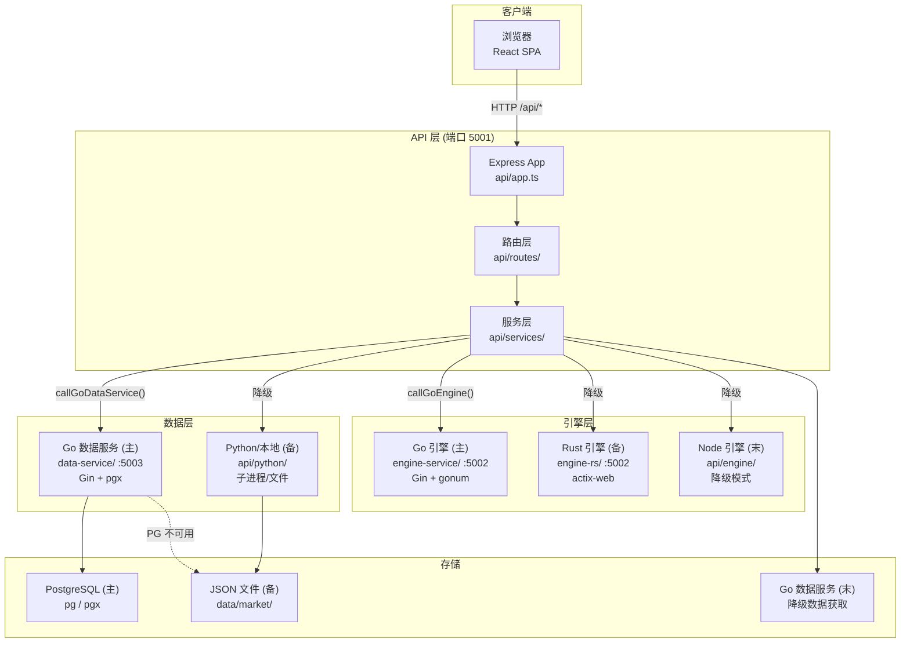

# 架构详解 (Architecture)

> 本文档详细描述回测平台的服务拓扑、降级链、数据流和关键设计决策。
> 结构规范见 [project-spec.md](../.trae/documents/project-spec.md)，API 定义见 [tech-architecture.md](../.trae/documents/tech-architecture.md)。

---

## 1. 服务拓扑



---

## 2. 降级链详解

### 2.1 引擎降级（Go → Rust → Node）

**降级链**：Go 引擎（主）→ Rust 引擎（备）→ Node 引擎（末）

**触发条件**（见 [api/routes/backtestRoutes.ts](../api/routes/backtestRoutes.ts) 的引擎调用逻辑）：

- 连接拒绝（ECONNREFUSED）
- HTTP 状态码非 2xx
- 5 秒超时（`timeoutMs = 5000`）
- 熔断器 Open 状态（见 [ADR-016](adr/ADR-016-熔断器策略.md)）

**降级逻辑**：

```typescript
const goResult = await callGoEngine('/api/engine/backtest', goBody);
const rustResult = !goResult ? await callRustEngine('/api/engine/backtest', rustBody) : null;
const isDegraded = !goResult || !rustResult;
result = goResult || rustResult || runPortfolioBacktest(portfolios, priceData, parameters);
// 降级时返回 degraded: true + degradedWarning
```

**降级约束**：

- Node 备用引擎（[api/engine/portfolio.ts](../api/engine/portfolio.ts)）不支持：通胀调整、汇率换算、drag、扩展提款统计
- 降级时响应体包含 `degraded: true` 和 `degradedWarning` 字段
- 前端收到降级标志须显示提示

### 2.2 数据降级（PostgreSQL → JSON → Go 数据服务）

**降级链**：PostgreSQL（主）→ JSON 文件（备）→ Go 数据服务（末）

**触发条件**（见 [api/routes/dataRoutes.ts](../api/routes/dataRoutes.ts) 的 `callService`）：

- 连接拒绝（ECONNREFUSED）
- HTTP 状态码非 2xx
- 30 秒超时（`timeoutMs = 30000`）
- PostgreSQL 熔断器 Open 状态（见 [ADR-016](adr/ADR-016-熔断器策略.md)）

**降级逻辑**：

- PostgreSQL 不可用 → 读取本地 `data/market/` JSON 文件（[api/services/dataService.ts](../api/services/dataService.ts)）
- JSON 文件不可用 → Go 数据服务获取（baostock / HTTP API）
- CPI 数据：PostgreSQL 失败 → 直接读取本地 `data/market/cpi/*.json`
- 搜索：PostgreSQL 全文搜索失败 → `searchTickers()` 调用 Python 或本地索引

---

## 3. 数据流

### 3.1 组合回测完整流程

```
1. 用户在前端设置参数 + 组合 → 点击"回测"
2. 前端 POST /api/backtest/portfolio { portfolios, parameters }
3. 后端 backtestRoutes.ts:
   a. 收集所有 ticker（组合资产 + 基准）
   b. fetchHistoryData() 获取价格数据
      - 优先 PostgreSQL 查询（pg Pool）
      - PostgreSQL 不可用降级 JSON 文件
      - JSON 不可用降级 Go 数据服务
   c. 加载 CPI 数据（按 baseCurrency 选择 cn/us）
   d. 加载汇率数据（baseCurrency === 'cny' 时）
   e. callGoEngine('/api/engine/backtest', goBody)
      - 失败降级 callRustEngine()（Rust 引擎）
      - 再失败降级 runPortfolioBacktest()（Node 引擎）
   f. 返回 { success, data, degraded?, warnings? }
4. 前端渲染结果（增长图/回撤/统计/年度收益/月度收益/相关性）
```

### 3.2 蒙特卡洛模拟流程

```
1. 前端 POST /api/backtest/monte-carlo { portfolio|portfolios, parameters, mcParams }
2. 后端:
   a. 获取价格数据
   b. 对第一个组合调用 Go 引擎 /api/engine/monte-carlo
   c. Go 引擎不可用时降级 Rust 引擎，再降级 Node 引擎
3. 返回百分位路径、成功概率、分布统计
```

---

## 4. 端口分配

| 服务        | 端口 | 配置位置                       |
| ----------- | ---- | ------------------------------ |
| 前端 Vite   | 5173 | vite.config.ts                 |
| 后端 API    | 5001 | `PORT` 环境变量 / server.ts    |
| Go 引擎     | 5002 | engine-service/ (环境变量)     |
| Rust 引擎   | 5002 | engine-rs/src/main.rs (硬编码) |
| Go 数据服务 | 5003 | data-service/ (环境变量)       |
| PostgreSQL  | 5432 | DATABASE_URL 环境变量          |

---

## 5. 入口文件职责

后端有 3 个入口文件，职责不同：

| 文件                              | 用途                   | 说明                                                      |
| --------------------------------- | ---------------------- | --------------------------------------------------------- |
| [api/app.ts](../api/app.ts)       | Express 应用配置       | 中间件、路由挂载、错误处理。被 server.ts 和 index.ts 引用 |
| [api/server.ts](../api/server.ts) | 本地开发入口           | `app.listen()` 启动 HTTP 服务，处理 SIGTERM/SIGINT        |
| [api/index.ts](../api/index.ts)   | Vercel Serverless 入口 | 导出 handler 函数，不调用 listen                          |

---

## 6. 关键模块

### 6.1 后端路由层 (`api/routes/`)

| 文件                  | 路径前缀           | 职责                             |
| --------------------- | ------------------ | -------------------------------- |
| `dataRoutes.ts`       | `/api/data`        | 历史数据、搜索、CPI              |
| `dataManageRoutes.ts` | `/api/data/manage` | 数据管理（批量更新等）           |
| `backtestRoutes.ts`   | `/api/backtest`    | 回测/分析/蒙特卡洛/优化/有效前沿 |
| `adminRoutes.ts`      | `/api/admin`       | 管理后台接口                     |

> 注：认证授权已实现 JWT + RBAC 模型（见 [ADR-017](adr/ADR-017-认证授权模型.md)），保留 `x-api-key` 兼容模式（analyst 角色）。

### 6.2 后端服务层 (`api/services/`)

| 文件                  | 职责                                                   |
| --------------------- | ------------------------------------------------------ |
| `dataService.ts`      | 价格数据获取（Python 子进程 + JSON 缓存）、ticker 搜索 |
| `engineService.ts`    | 引擎调用封装                                           |
| `batchDataService.ts` | 批量数据服务                                           |

### 6.3 Node 降级引擎 (`api/engine/`)

| 文件            | 对应 Go/Rust 实现                                          | 职责               |
| --------------- | ---------------------------------------------------------- | ------------------ |
| `portfolio.ts`  | `engine-service/` + `engine-rs/src/engine.rs`              | 组合回测、资产分析 |
| `statistics.ts` | `engine-service/` + `engine-rs/src/engine.rs` (Statistics) | 统计指标计算       |
| `monteCarlo.ts` | `engine-service/` + `engine-rs/src/monte_carlo.rs`         | 蒙特卡洛模拟       |
| `optimizer.ts`  | `engine-service/` + `engine-rs/src/optimizer.rs`           | 组合优化、有效前沿 |

### 6.4 Go 引擎 (`engine-service/`)

| 模块     | 职责                                             |
| -------- | ------------------------------------------------ |
| 回测核心 | 组合回测、统计指标、SWR/PWR（gonum/stat）        |
| 蒙特卡洛 | 区块自举采样（gonum/stat/dist + sync.Pool 并行） |
| 优化器   | Markowitz 优化、有效前沿（gonum/optimize）       |

### 6.5 Rust 引擎 (`engine-rs/src/`)（降级备选）

| 文件             | 职责                                        |
| ---------------- | ------------------------------------------- |
| `main.rs`        | actix-web 服务入口、请求校验、路由          |
| `engine.rs`      | 回测核心算法、统计指标、SWR/PWR             |
| `monte_carlo.rs` | 蒙特卡洛区块自举采样                        |
| `optimizer.rs`   | Markowitz 优化、有效前沿（nalgebra 闭式解） |

### 6.6 前端页面 (`src/pages/`)

| 页面                             | 路由                       | 功能             |
| -------------------------------- | -------------------------- | ---------------- |
| `BacktestPage.tsx`               | `/`                        | 组合回测（主页） |
| `AnalysisPage.tsx`               | `/analysis`                | 资产分析         |
| `MonteCarloPage.tsx`             | `/monte-carlo`             | 蒙特卡洛模拟     |
| `OptimizerPage.tsx`              | `/optimizer`               | 组合优化         |
| `EfficientFrontierPage.tsx`      | `/efficient-frontier`      | 有效前沿         |
| `RebalancingSensitivityPage.tsx` | `/rebalancing-sensitivity` | 调仓敏感性       |
| `LumpSumVsDCAPage.tsx`           | `/lumpsum-vs-dca`          | 一次性 vs 定投   |
| `FactorRegressionPage.tsx`       | `/factor-regression`       | 因子回归         |
| `CalculatorsPage.tsx`            | `/calculators`             | 计算器           |
| `DataEnginePage.tsx`             | `/data-engine`             | 数据引擎         |
| `AboutPage.tsx`                  | `/about`                   | 关于             |

---

## 7. 共享类型 (`shared/`)

[shared/types.ts](../shared/types.ts) 定义前后端共享的类型，包括：

- `Portfolio` / `Asset` / `RebalanceFrequency` - 组合定义
- `BacktestParameters` / `CashflowLeg` / `OneTimeCashflow` - 回测参数
- `Statistics` - 统计指标（60+ 字段）
- `PortfolioResult` / `BacktestResult` - 回测结果
- `MonteCarloParameters` / `MonteCarloResult` - 蒙特卡洛
- `OptimizationResult` / `EfficientFrontierResult` - 优化器
- `CHART_COLORS` - 图表颜色常量

---

## 8. 数据目录 (`data/`)

```
data/
├── market/
│   └── tickers/          # 标的行情 (数千 JSON，如 AAPL.json，由 data-fetcher 管理)
└── cache/                # 运行时缓存 (gitignore)
```

---

## 9. 设计决策

### 9.1 为什么用多语言而非单语言？

- **Go**：计算密集型（回测/蒙特卡洛/优化）+ 数据服务（并发 HTTP + baostock），goroutine 并行模型适合 I/O+CPU 混合场景
- **Rust**：作为引擎降级备选保留，过渡期并行运行（见 ADR-008）
- **Python**：akshare/yfinance 生态丰富，用于数据抓取（逐步迁移至 Go，见 ADR-008）
- **TypeScript**：前后端共享类型，前端 React 生态成熟

### 9.2 为什么保留 Node 降级引擎？

- Go/Rust 引擎需要单独启动，开发时可能不运行
- 降级保证核心功能可用（虽功能不完整）
- 降级时明确警告用户

### 9.3 数据存储演进：JSON → SQLite → PostgreSQL

- 早期采用 JSON 文件存储（见 ADR-002，已被 ADR-006 取代）
- 2026-06 初，数据读取路径迁移至 SQLite（better-sqlite3 + WAL 模式，见 ADR-006）
- 2026-06 中，从 SQLite 迁移至 PostgreSQL（pgx + pg 驱动，见 ADR-007）
  - 解除多实例水平扩展阻塞（SQLite 单文件无法跨 Pod 共享）
  - 获得连接池、全文搜索（tsvector + GIN）、流复制等企业级能力
- `api/db/index.ts` 实现版本化 schema 迁移，`api/db/import.ts` 提供 JSON→PostgreSQL 导入
- JSON 文件保留为数据源和降级 fallback（PostgreSQL 不可用时回退）
- 迁移决策详见 [ADR-006](adr/ADR-006-SQLite迁移决策.md)、[ADR-007](adr/ADR-007-PostgreSQL迁移决策.md)

### 9.4 已知局限性

- **Go 数据服务信号量=10**：`dataService.ts:187` 限制对 data-fetcher 并发（ADR-027）
- **Rust 引擎过渡期**：Go 为主，Rust 二级，Node 末级
- **x-api-key 兼容风险**：静态 Key 无法按用户撤销（ADR-017）
- **Redis 依赖**：会话/限流/幂等；fail-closed 或内存回退

### 9.5 ADR 索引

| ADR                                                    | 主题                         | 状态                  |
| ------------------------------------------------------ | ---------------------------- | --------------------- |
| [ADR-001](adr/ADR-001-多语言架构.md)                   | 多语言架构                   | 已取代（见 ADR-008）  |
| [ADR-002](adr/ADR-002-JSON文件存储.md)                 | JSON 文件存储                | 已取代（见 ADR-006）  |
| [ADR-003](adr/ADR-003-Rust主引擎Node备用.md)           | Rust 主引擎 Node 备用        | 已取代（Go 引擎为主） |
| [ADR-004](adr/ADR-004-Express框架选型.md)              | Express 框架选型             | 已接受                |
| [ADR-005](adr/ADR-005-Pino日志选型.md)                 | Pino 日志选型                | 已接受                |
| [ADR-006](adr/ADR-006-SQLite迁移决策.md)               | JSON→SQLite 迁移             | 已取代（见 ADR-007）  |
| [ADR-007](adr/ADR-007-PostgreSQL迁移决策.md)           | SQLite→PostgreSQL 迁移       | 已接受                |
| [ADR-008](adr/ADR-008-语言精简决策.md)                 | 4 语言→Go+TypeScript 精简    | 已接受                |
| [ADR-009](adr/ADR-009-请求体校验库选型.md)             | 请求体校验库选型（zod）      | 已接受                |
| [ADR-010](adr/ADR-010-密钥扫描工具选型.md)             | 密钥扫描工具选型（gitleaks） | 已接受                |
| [ADR-011](adr/ADR-011-长任务异步化方案.md)             | 长任务异步化方案（BullMQ）   | 已接受                |
| [ADR-012](adr/ADR-012-SBOM与制品签名方案.md)           | SBOM 与制品签名              | 已接受                |
| [ADR-013](adr/ADR-013-领域模型重构策略.md)             | 领域模型重构策略（DDD）      | 已接受                |
| [ADR-014](adr/ADR-014-事件溯源Outbox方案.md)           | 事件溯源/Outbox 方案         | 已接受                |
| [ADR-015](adr/ADR-015-可观测性技术选型.md)             | 可观测性技术选型             | 已接受                |
| [ADR-016](adr/ADR-016-熔断器策略.md)                   | 熔断器策略                   | 已接受                |
| [ADR-017](adr/ADR-017-认证授权模型.md)                 | 认证授权模型                 | 已接受                |
| [ADR-018](adr/ADR-018-Redis选型.md)                    | Redis 选型                   | 已接受                |
| [ADR-019](adr/ADR-019-异步任务越权防护与所有权模型.md) | Job 所有权                   | 已接受                |
| [ADR-020](adr/ADR-020-限流fail-closed分级策略.md)      | 限流 fail-closed             | 已接受                |
| [ADR-021](adr/ADR-021-代码复杂度量化门控.md)           | 复杂度门控                   | 已接受                |
| [ADR-022](adr/ADR-022-SLSA出处证明与全量SBOM治理.md)   | SBOM/SLSA                    | 已接受                |
| [ADR-023](adr/ADR-023-数据隐私分类与删除权实现.md)     | GDPR                         | 已接受                |
| [ADR-024](adr/ADR-024-Outbox强一致与消费者幂等.md)     | Outbox                       | 已接受                |
| [ADR-025](adr/ADR-025-apiLimiter全局fail-closed.md)    | 全局限流                     | 已接受                |
| [ADR-026](adr/ADR-026-开发环境认证旁路安全边界.md)     | DEV_SKIP_AUTH                | 已接受                |
| [ADR-027](adr/ADR-027-100x容量拐点与缓解.md)           | 100x 容量                    | 已接受                |
| [ADR-028](adr/ADR-028-重试与幂等边界.md)               | 重试幂等                     | 已接受                |
| [ADR-029](adr/ADR-029-cursor分页策略.md)               | 分页策略                     | 已接受                |
| [ADR-030](adr/ADR-030-distroless评估.md)               | distroless                   | 已接受                |

---

## 10. 可观测性栈

详见 [ADR-015](adr/ADR-015-可观测性技术选型.md)。

| 支柱    | Node.js                           | Go                       | Rust                   |
| ------- | --------------------------------- | ------------------------ | ---------------------- |
| 日志    | pino（结构化 JSON）               | slog（结构化 JSON）      | tracing（结构化 JSON） |
| 指标    | prom-client（Prometheus 格式）    | prometheus/client_golang | —                      |
| 追踪    | @opentelemetry/sdk-node           | otelgin + OTLP（已接线） | opentelemetry crate    |
| DB 追踪 | @opentelemetry/instrumentation-pg | pgx OTel 集成            | —                      |

**Collector 架构**：各服务 → OTel Collector → Jaeger/Tempo（追踪）+ Prometheus（指标）

---

## 11. 熔断器策略

详见 [ADR-016](adr/ADR-016-熔断器策略.md)。

| 服务         | 熔断器                  | 保护目标                        |
| ------------ | ----------------------- | ------------------------------- |
| Go 引擎      | opossum（Node.js 侧）   | 引擎层降级：Go→Rust→Node        |
| Rust 引擎    | opossum（Node.js 侧）   | 引擎层降级：Rust→Node           |
| PostgreSQL   | opossum（Node.js 侧）   | 数据层降级：PG→JSON→Go 数据服务 |
| BaoStock API | sony/gobreaker（Go 侧） | 数据获取降级                    |

**熔断器配置**：50% 失败率触发 Open，10s 后 HalfOpen 探测。PostgreSQL 熔断器替代原有 `dbAvailable` 布尔标记，提供自动恢复能力。

---

## 12. 认证授权模型

详见 [ADR-017](adr/ADR-017-认证授权模型.md)。

| 维度          | 实现                                              |
| ------------- | ------------------------------------------------- |
| 认证          | JWT（jose 库，RS256 算法）                        |
| 兼容模式      | x-api-key → analyst 角色                          |
| 授权          | RBAC 三角色（ADMIN / ANALYST / READONLY）× 七权限 |
| Access Token  | 15 分钟有效期                                     |
| Refresh Token | 7 天有效期 + 轮换机制，存储于 Redis               |
| 幂等性        | Idempotency-Key 中间件，Redis 存储                |

---

## 13. 100x 流量扩展（ADR-027）

> 规范路径 `docs/architecture.md` 在 Windows 上与本文档为同一文件（大小写不敏感）。

| 顺序 | 瓶颈                    | 观测指标                     | 缓解                               |
| ---- | ----------------------- | ---------------------------- | ---------------------------------- |
| 1    | Compute / Node 事件循环 | `node_eventloop_lag_seconds` | BullMQ、HPA、Go 引擎扩展           |
| 2    | PostgreSQL 连接池       | `pg_pool_waiting_count`      | PgBouncer、读副本、`getReadPool()` |
| 3    | 数据服务 + 外部 API     | `data_service_semaphore_*`   | 缓存、gobreaker                    |
| 4    | Redis                   | 503 限流                     | Sentinel/Cluster                   |

详见 [`capacity-planning.md`](./capacity-planning.md)。
