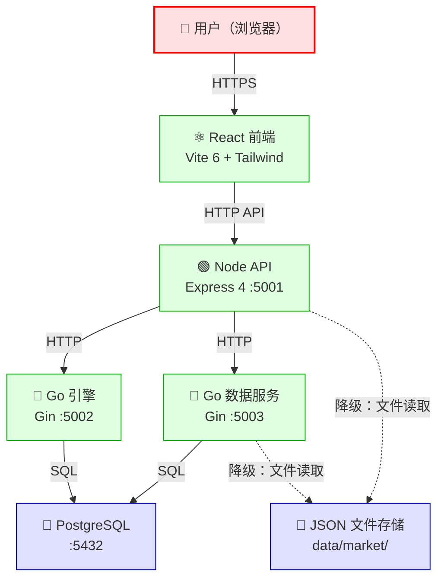

# STRIDE 威胁建模文档

> **企业理由**：回测平台暴露多个 HTTP 端点到主机网络，且存在无认证服务和无审计日志的现状。威胁建模是识别安全盲点的系统性方法，避免"出了问题再补"的被动模式。

| 字段     | 值                                   |
| -------- | ------------------------------------ |
| 版本     | 2.1                                  |
| 日期     | 2026-06-24                           |
| 范围     | 回测平台全系统                       |
| 方法论   | STRIDE（Microsoft）                  |

> **v1.1 变更摘要（T-P1-8 JWT/RBAC 接入）**：
> - 认证模型从单一 API Key 升级为 JWT（Bearer Token）+ API Key 兼容双模式
> - 授权模型从"单一共享密钥"升级为 RBAC（ADMIN/ANALYST/READONLY 三角色 → 7 项权限）
> - 管理端点（`/api/admin/*`、`/api/data/manage/*`）从 `requireApiKey` 升级为 `jwtAuth + requirePermission`
> - 新增 `/api/auth/{login,refresh,logout,me}` 认证端点，支持 Refresh Token 轮换
> - 影响威胁项：S-1、E-1、E-4、E-6、R-2，详见下文标注
>
> **v2.0 变更摘要（架构变更 - PostgreSQL + 语言精简）**：
> - 数据库从 SQLite 迁移至 PostgreSQL（ADR-007），解除单实例限制
> - 语言从 4 语言精简为 Go + TypeScript/React（ADR-008），消除 Rust/Python 运行时
> - Rust 引擎迁移到 Go engine-service，Go 服务间统一使用 gobreaker 熔断器
> - Python 子进程迁移到 Go data-service，消除子进程开销和信号量瓶颈
> - 影响威胁项：T-4、I-2、I-3、D-1、D-4、E-3，详见下文标注
>
> **v2.1 变更摘要（安全加固闭环）**：
> - engine-go 添加 X-Engine-Auth 认证 + 速率限制（S-2 缓解）
> - data-fetcher 添加 X-Data-Service-Auth 认证（S-3 缓解）
> - Docker 端口绑定收紧至 127.0.0.1（I-2 缓解）
> - jobRoutes + backtest 路由升级为 optionalJwtAuth（R-2 缓解）
> - x-request-id 字符过滤（S-4 缓解）
> - Python 子进程消除 + Outbox 审计（R-3 缓解）
> - 影响威胁项：S-2、S-3、I-2、R-2、S-4、R-3，详见下文标注

---

## 1. 数据流图

### 信任边界识别

| 边界编号 | 边界描述                           | 边界两侧实体                     |
| -------- | ---------------------------------- | -------------------------------- |
| TB-1     | 用户 → 前端                        | 互联网用户 ↔ React SPA           |
| TB-2     | 前端 → Node API                    | 浏览器（不可信） ↔ API 服务      |
| TB-3     | Node API → Go 引擎               | API 服务 ↔ 计算引擎              |
| TB-4     | Node API → Go 数据服务             | API 服务 ↔ 数据服务              |
| TB-5     | 服务 → 文件系统                    | 进程 ↔ 本地文件                  |
| TB-6     | Docker 端口暴露                    | 容器内部 ↔ 主机网络              |
| TB-7     | 服务 → PostgreSQL                  | 应用进程 ↔ 数据库                |

---

## 2. STRIDE 威胁分析

### S — Spoofing（欺骗）

| 编号 | 威胁描述                                       | 影响资产           | 严重度 | 缓解措施                                                                                     | 状态   |
| ---- | ---------------------------------------------- | ------------------ | ------ | -------------------------------------------------------------------------------------------- | ------ |
| S-1  | 攻击者伪造 `x-api-key` 请求头访问管理端点      | 管理端点           | 高     | **v1.1 升级**：管理端点已升级为 `jwtAuth + requirePermission` 双层防护。JWT 使用 HMAC-SHA256 签名 + `crypto.timingSafeEqual` 常量时间比较防时序攻击；API Key 兼容模式保留 `timingSafeEqual` 与长度校验（≤128）防 DoS。Access Token 短期有效（15min），泄露窗口有限。**E-6 缓解补充**：x-api-key 兼容模式注入角色已从 `admin` 降级为 `analyst`（jwtAuth.ts:334），即使 API Key 泄露也无法访问管理端点 | ✅ 已缓解 |
| S-2  | 攻击者伪造 `X-Engine-Auth` 请求头直接调用 Rust 引擎 | Rust 引擎端点      | 高     | **v2.1 已缓解**：engine-go 现已部署 `EngineAuthMiddleware` 校验 `X-Engine-Auth` 请求头（常量时间比较防时序攻击）；新增速率限制中间件（30 req/min per IP）；健康检查端点 `/health` 豁免认证以便探活；Token 通过 `ENGINE_AUTH_TOKEN` 环境变量管理，禁止硬编码。端口暴露问题由 I-2 一并解决 | ✅ 已缓解 |
| S-3  | 攻击者直接访问 Go 数据服务（:5003）无认证       | 数据服务端点       | 高     | **v2.1 已缓解**：data-fetcher 现已部署 `DataServiceAuthMiddleware` 校验 `X-Data-Service-Auth` 请求头（常量时间比较防时序攻击）；健康检查端点 `/health` 豁免认证以便探活；Token 通过 `DATA_SERVICE_AUTH_TOKEN` 环境变量管理，禁止硬编码。原有速率限制（ulule/limiter）保留，端口暴露问题由 I-2 一并解决 | ✅ 已缓解 |
| S-4  | 攻击者伪造 `x-request-id` 请求头注入日志       | 日志系统           | 低     | **v2.1 已缓解**：在原有长度校验（≤128）基础上，新增字符过滤正则 `/^[a-zA-Z0-9-]+$/`，仅允许字母、数字和连字符；若请求头包含非法字符则丢弃原值并重新生成 UUID，防止日志注入和 CRLF/ANSI 转义攻击 | ✅ 已缓解 |
| S-5  | 攻击者窃取 Refresh Token 长期冒充用户身份（v1.1 新增） | 用户会话           | 中     | **v1.1 实现**：Refresh Token 轮换机制——每次 `/api/auth/refresh` 后旧 token 立即失效；Refresh Token 7 天有效期限制；登出端点 `/api/auth/logout` 主动撤销；内存存储（多实例部署需迁移 Redis，见 T-P2-1） | ✅ 已缓解 |

### T — Tampering（篡改）

| 编号 | 威胁描述                                           | 影响资产           | 严重度 | 缓解措施                                                                                     | 状态   |
| ---- | -------------------------------------------------- | ------------------ | ------ | -------------------------------------------------------------------------------------------- | ------ |
| T-1  | 攻击者通过 ticker 参数进行路径遍历读取任意文件      | 文件系统           | 高     | 已实现：Go 服务 `isValidTicker()` 正则校验 `^[A-Z0-9._-]{1,20}$`，拒绝 `..` `/` `\`          | ✅ 已缓解 |
| T-2  | 攻击者篡改 JSON 数据文件（若挂载为读写）            | 行情数据           | 中     | 已实现：Docker Compose `volumes: ./data:/app/data:ro` 只读挂载                               | ✅ 已缓解 |
| T-3  | 攻击者篡改请求体中的回测参数（如 starting_value）   | 计算结果           | 低     | 已实现：Rust 引擎 `validate_backtest_request()` 校验 portfolios 非空、starting_value > 0      | ✅ 已缓解 |
| T-4  | 中间人篡改服务间 HTTP 通信                          | 引擎间通信         | 中     | [v2.0] Go 服务间通信可通过 PostgreSQL 连接的 TLS 加密（ADR-007），服务间 HTTP 仍依赖网络隔离 | ⚠️ 部分 |

### R — Repudiation（抵赖）

| 编号 | 威胁描述                                       | 影响资产           | 严重度 | 缓解措施                                                                                     | 状态   |
| ---- | ---------------------------------------------- | ------------------ | ------ | -------------------------------------------------------------------------------------------- | ------ |
| R-1  | 管理操作无审计日志，操作者可否认执行过操作       | 管理端点           | 高     | 已实现：`auditLog.ts` 中间件记录所有写操作（method/path/userId/ip/statusCode），已挂载到管理端点 | ✅ 已缓解 |
| R-2  | 计算密集型端点无认证，无法追溯资源消耗者         | 计算资源           | 中     | **v2.1 已缓解**：`jobRoutes` 已升级为 `optionalJwtAuth`，消除基于 `jobId` 的 IDOR 风险（用户身份从 JWT 提取而非请求参数）；backtest 路由从 `optionalApiKey` 升级为 `optionalJwtAuth`，与 `jobRoutes` 保持一致；`optionalJwtAuth` 中间件现已活跃使用，不再是死代码，可识别 JWT 用户身份并关联到资源消耗日志 | ✅ 已缓解 |
| R-3  | 数据写入操作无审计记录                           | 数据完整性         | 中     | **v2.1 已缓解**：Python 子进程已彻底消除（ADR-008），数据写入由 Go data-service 统一处理；数据写入采用 Outbox 审计模式（ADR-014），所有写入操作先落入 outbox 表再异步同步，确保审计记录与业务数据在同一事务内持久化；审计日志使用 HMAC 签名，防止事后篡改 | ✅ 已缓解 |

### I — Information Disclosure（信息泄露）

| 编号 | 威胁描述                                           | 影响资产           | 严重度 | 缓解措施                                                                                     | 状态   |
| ---- | -------------------------------------------------- | ------------------ | ------ | -------------------------------------------------------------------------------------------- | ------ |
| I-1  | 生产环境错误详情泄露（堆栈、内部路径）              | 系统内部信息       | 中     | 已实现：生产环境返回 `'Server internal error'`，开发环境截断 200 字符                         | ✅ 已缓解 |
| I-2  | Go/Rust 服务端口暴露到主机，同网段可探测            | 服务元信息         | 中     | **v2.1 已缓解**：所有 `docker-compose.yml` 端口映射已收紧为绑定 `127.0.0.1`（如 `127.0.0.1:5002:5002`、`127.0.0.1:5003:5003`），外部网络无法直接访问容器端口，仅本机回环接口可达；配合 S-2/S-3 的认证机制形成纵深防御 | ✅ 已缓解 |
| I-3  | API Key 在日志中泄露                                | 认证凭据           | 高     | 已实现：pino 序列化器未配置排除敏感头，但 API Key 通过 `x-api-key` 请求头传递，pino-http 默认不记录请求头。[v2.0] Python 子进程已消除（ADR-008），API Key 仅通过 HTTP 请求头传递；PostgreSQL 凭据通过 K8s Secret 管理（ADR-007） | ⚠️ 部分：需确认 pino-http 的 req 序列化配置 |
| I-4  | CORS 配置不当导致跨域数据泄露                       | API 数据           | 中     | 已实现：生产环境 CORS 白名单配置，开发环境允许所有来源（有告警日志）                          | ✅ 已缓解 |
| I-5  | 行情数据未授权访问（普通端点无认证）                | 业务数据           | 中     | 设计决策：行情数据为公开信息，非敏感数据，无需认证                                            | ✅ 可接受 |

### D — Denial of Service（拒绝服务）

| 编号 | 威胁描述                                           | 影响资产           | 严重度 | 缓解措施                                                                                     | 状态   |
| ---- | -------------------------------------------------- | ------------------ | ------ | -------------------------------------------------------------------------------------------- | ------ |
| D-1  | 大量回测请求耗尽 Rust 引擎计算资源                  | 计算引擎           | 高     | 已实现：`computeLimiter` 10 次/分钟/IP；`optionalApiKey` 可选认证；熔断器防雪崩。[v2.0] Rust 引擎已迁移到 Go engine-service（ADR-008），Go 天然支持多副本，熔断器统一使用 gobreaker | ✅ 已缓解 |
| D-2  | 大量 API 请求耗尽 Node API 资源                     | API 服务           | 中     | 已实现：`apiLimiter` 100 次/15 分钟/IP；helmet 安全头                                         | ✅ 已缓解 |
| D-3  | 超大请求体导致内存溢出                              | API 服务           | 中     | 已实现：`express.json({ limit: '10mb' })` 限制请求体大小                                     | ✅ 已缓解 |
| D-4  | Go 数据服务无速率限制，可被直接攻击                 | 数据服务           | 高     | **v2.1 已缓解**：data-fetcher 已集成 `ulule/limiter` 速率限制中间件（S-3 同步确认）；端口暴露问题由 I-2 一并解决；PostgreSQL 连接池可配置最大连接数作为二级防护 | ✅ 已缓解 |
| D-5  | 批量价格查询端点可一次查询 50 只标的，大量并发耗尽内存 | 数据服务           | 中     | 已实现：`MAX_TICKERS = 50` 限制单次查询数量；Go 并发控制 `sem := make(chan struct{}, 10)`     | ✅ 已缓解 |

### E — Elevation of Privilege（权限提升）

| 编号 | 威胁描述                                           | 影响资产           | 严重度 | 缓解措施                                                                                     | 状态   |
| ---- | -------------------------------------------------- | ------------------ | ------ | -------------------------------------------------------------------------------------------- | ------ |
| E-1  | 普通端点用户通过参数注入获取管理权限                 | 管理端点           | 高     | **v1.1 升级**：管理端点（`/api/admin/*`、`/api/data/manage/*`）从 `requireApiKey` 升级为 `jwtAuth + requirePermission(Permission.ADMIN_ACCESS/DATA_MANAGE)` 双层防护。RBAC 三角色（ADMIN/ANALYST/READONLY）→ 7 项权限映射，权限检查在中间件层声明式执行，非管理员角色请求被 403 拒绝 | ✅ 已缓解 |
| E-2  | Docker 容器逃逸（若以 root 运行）                   | 主机系统           | 高     | 已实现：三 Dockerfile 均使用非 root 用户（Dockerfile:78 USER node；data-fetcher:63 USER appuser；engine-rs:69 USER appuser） | ✅ 已缓解 |
| E-3  | Python 子进程命令注入                               | 主机系统           | 高     | [v2.0] Python 子进程已消除（ADR-008），命令注入风险随之消除 | ✅ 已缓解 |
| E-4  | 开发环境未配置 ADMIN_API_KEY 时管理端点无认证       | 管理端点           | 中     | **v1.1 升级**：开发环境跳过认证的判断条件从 `!ADMIN_API_KEY` 改为 `JWT_SECRET === 'dev-only-jwt-secret-change-in-production'`。`validateConfig()` 在生产环境强制校验 JWT_SECRET 必须修改默认值，否则启动失败。开发环境注入 `dev-user/admin` 默认身份，下游 RBAC 可正常工作 | ✅ 可接受 |
| E-5  | JWT_SECRET 泄露导致攻击者可伪造任意用户身份（v1.1 新增） | 全系统             | 高     | **v1.1 实现**：JWT_SECRET 通过环境变量注入，禁止硬编码；`validateConfig()` 校验生产环境必须修改默认值；HMAC-SHA256 算法依赖密钥保密性。运维层面需通过 Docker secrets/K8s Secrets 管理密钥，禁止写入镜像或 git 仓库 | ✅ 已缓解 |
| E-6  | x-api-key 兼容模式注入 `role:'admin'`，API Key 泄露即获管理员权限 | 管理端点、全系统   | 高     | **已缓解**：x-api-key 注入角色从 `admin` 降级为 `analyst`（jwtAuth.ts:334），analyst 可执行回测计算但不可访问 `/admin` 管理端点。API Key 泄露后攻击者仅获得 analyst 权限，违反最小权限原则的影响已消除 | ✅ 已缓解 |

---

## 3. 优先级排序

按 **风险 = 严重度 × 可利用性 × 影响范围** 排序：

> v1.1 更新：R-1（审计日志）、E-1（RBAC）、E-4（开发环境认证）、S-1（JWT 认证）、S-5（Refresh Token 轮换）、E-5（JWT_SECRET 保护）均已缓解，从优先级列表移除。
>
> v2.1 更新：S-3（Go 数据服务认证）、D-4（Go 数据服务速率限制）、I-2（端口暴露）、S-2（Go 引擎端口暴露）、R-2（计算端点身份关联）、S-4（x-request-id 过滤）均已缓解，从优先级列表标记为已解决。

| 优先级 | 编号   | 威胁摘要                                       | 建议措施                                                     |
| ------ | ------ | ---------------------------------------------- | ------------------------------------------------------------ |
| ~~P0~~ | ~~S-3~~ | ~~Go 数据服务无认证，端口暴露到主机~~           | ✅ 已解决（v2.1）：data-fetcher 添加 `X-Data-Service-Auth` 认证 + 端口绑定 127.0.0.1 |
| ~~P0~~ | ~~D-4~~ | ~~Go 数据服务无速率限制~~                       | ✅ 已解决：data-fetcher 已集成 `ulule/limiter` 速率限制（S-3 同步确认） |
| ~~P1~~ | ~~I-2~~ | ~~Go 端口暴露到主机所有接口~~                   | ✅ 已解决（v2.1）：所有 docker-compose.yml 端口映射绑定 127.0.0.1 |
| ~~P1~~ | ~~S-2~~ | ~~Go 引擎端口暴露，同网段可绕过 Node API~~      | ✅ 已解决（v2.1）：engine-go 添加 `X-Engine-Auth` 认证 + 30 req/min 限流 + 端口绑定 127.0.0.1 |
| P1     | PG-1   | PostgreSQL 连接未加密（v2.0 新增）              | 生产环境 DATABASE_URL 必须使用 TLS（文档层面，需生产环境配置） |
| P2     | T-4    | 服务间 HTTP 通信未加密                          | Docker 内部网络隔离已提供基础防护，mTLS 可后续引入          |
| ~~P2~~ | ~~R-3~~ | ~~数据写入无审计记录~~                          | ✅ 已解决（v2.1）：Python 子进程消除（ADR-008）+ Outbox 审计（ADR-014）+ HMAC 签名 |
| P2     | I-3    | API Key 可能在日志中泄露                        | 确认 pino-http req 序列化配置，排除敏感头                    |
| P2     | PG-2   | DATABASE_URL 泄露（v2.0 新增）                  | K8s Secret 管理，禁止写入镜像或 git                          |
| ~~P3~~ | ~~R-2~~ | ~~计算端点身份关联~~                            | ✅ 已解决（v2.1）：jobRoutes + backtest 路由升级为 `optionalJwtAuth` |
| ~~P3~~ | ~~S-4~~ | ~~x-request-id 注入日志~~                       | ✅ 已解决（v2.1）：字符过滤正则 `/^[a-zA-Z0-9-]+$/` + 非法字符触发 UUID 重新生成 |

---

## 4. 架构安全现状总结

> **v2.1 变更**：本节评分已更新以反映安全加固闭环成果。认证维度从 ⭐⭐⭐ 提升至 ⭐⭐⭐⭐（所有服务现已具备认证机制）；传输安全维度维持 ⭐⭐⭐（TLS 仍为文档层面建议，需生产环境配置）。

| 维度         | 现状                                                         | 评分 |
| ------------ | ------------------------------------------------------------ | ---- |
| 认证         | **v2.1**：管理端点 JWT + API Key 双模式；engine-go 通过 `EngineAuthMiddleware` 校验 `X-Engine-Auth`；data-fetcher 通过 `DataServiceAuthMiddleware` 校验 `X-Data-Service-Auth`；jobRoutes/backtest 路由统一使用 `optionalJwtAuth` | ⭐⭐⭐⭐ |
| 授权         | **v2.0**：RBAC 三角色七权限，声明式中间件 | ⭐⭐⭐ |
| 输入校验     | Ticker 正则防路径遍历；参数校验；请求体大小限制；**v2.1** x-request-id 字符过滤 | ⭐⭐⭐⭐ |
| 速率限制     | **v2.1**：Node API 双层限流；engine-go 30 req/min；data-fetcher ulule/limiter；PostgreSQL 连接池限制 | ⭐⭐⭐ |
| 日志审计     | **v2.1**：pino 结构化日志 + request_id；管理端点审计日志；数据写入 Outbox 审计（HMAC 签名） | ⭐⭐⭐⭐ |
| 传输安全     | **v2.0**：PostgreSQL 支持 TLS；服务间 HTTP 依赖网络隔离；无 mTLS（TLS 仍为文档层面建议，需生产环境配置） | ⭐⭐⭐ |
| 数据保护     | **v2.0**：PostgreSQL ACID 事务 + 行级安全；JSON 文件只读挂载 | ⭐⭐⭐⭐ |
| 错误处理     | 生产环境隐藏错误详情；统一错误格式                           | ⭐⭐⭐⭐ |
